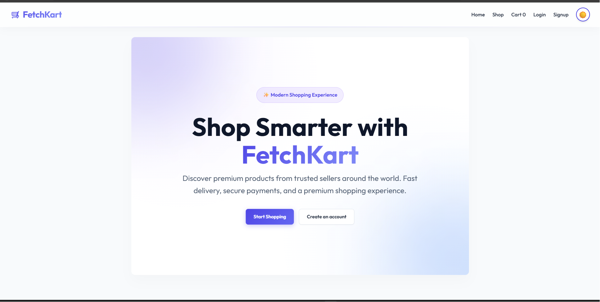
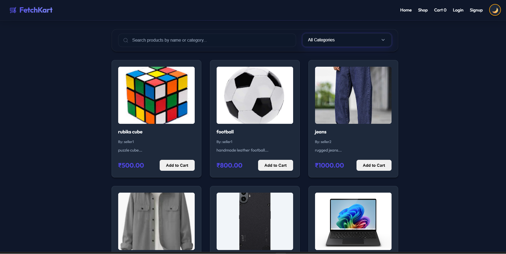
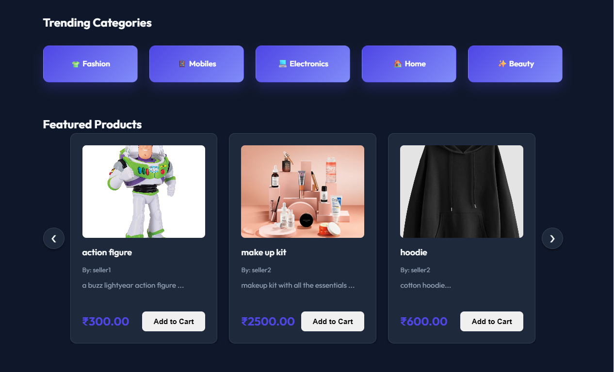
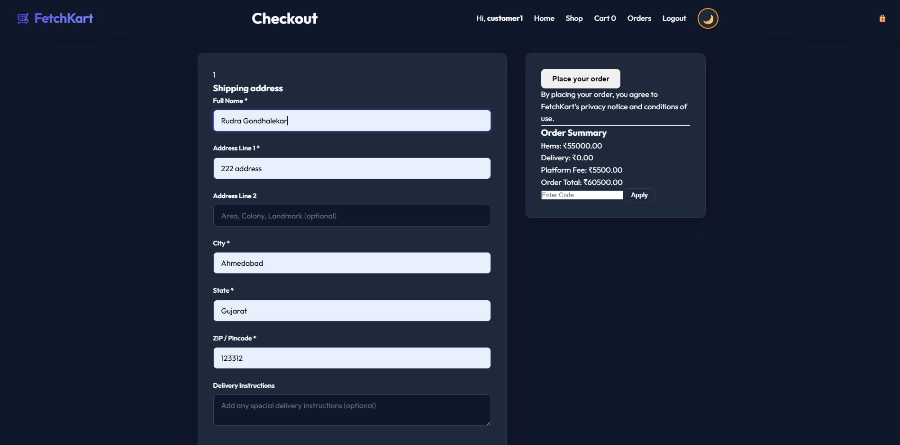
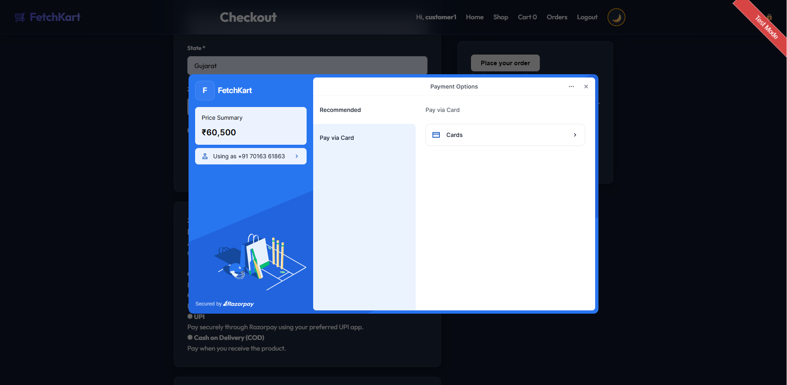
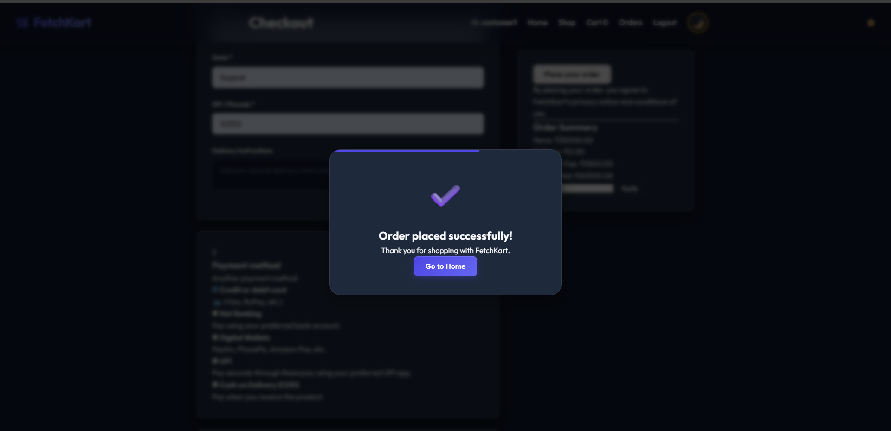
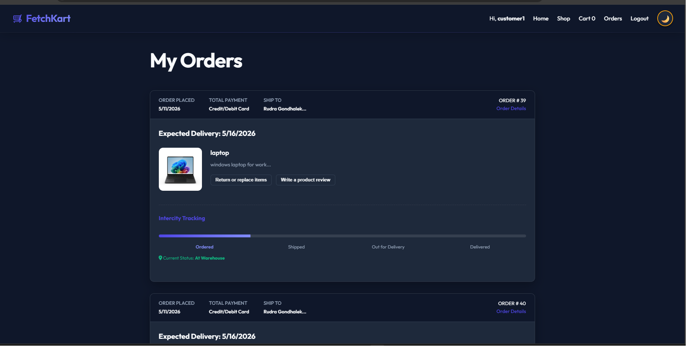
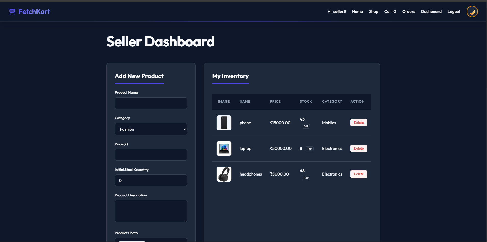
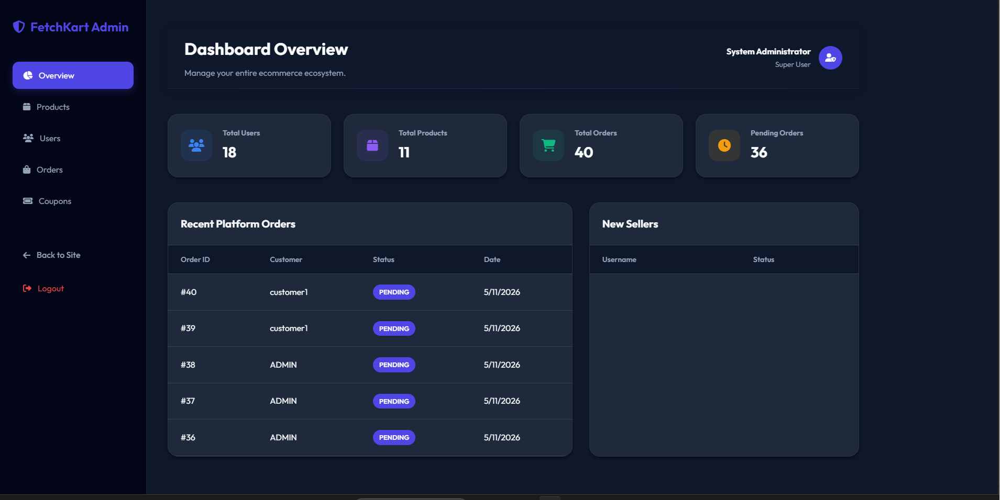

# FetchKart - Multi-Vendor E-commerce Platform

FetchKart is a modern multi-vendor e-commerce platform built using HTML, CSS, JavaScript, PHP, and MySQL.  
The project focuses on delivering a premium shopping experience with seller management, order tracking, payment integration, and responsive UI design.

---

# Features

## User Roles

### Customer

- Product browsing and search
- Add to cart and wishlist
- Coupon support
- Order tracking system
- Dark / Light mode support

### Seller

- Seller dashboard
- Product and inventory management
- Order monitoring
- Logistics preferences configuration

### Admin

- Platform overview dashboard
- User and product management
- Coupon management
- Order monitoring and analytics

---

# Checkout & Payments

- Multi-step checkout system
- Razorpay payment integration
- UPI and Cash on Delivery support
- Coupon code system
- Automated platform fee calculations
- Payment confirmation workflow

---

# Logistics & Tracking

- Intercity order tracking
- Local delivery simulation
- Delivery progress visualization
- Expected delivery estimation

---

# Security Features

- Session-based authentication
- Password hashing using PHP hashing functions
- CAPTCHA integration using Cloudflare Turnstile
- Role-based access control

---

# Screenshots

## Landing Page (Dark Mode)


---

## Landing Page (Light Mode)



---

## Product Catalog



---

## Featured Products Section



---

## Checkout System



---

## Razorpay Payment Integration



---

## Payment Confirmation



---

## Order Tracking



---

## Seller Dashboard



---

## Admin Dashboard



---

# Installation

## 1. Clone Repository

```bash
git clone https://github.com/Rudra-Gon/FetchKart.git
```

---

## 2. Move Project to WAMP/XAMPP htdocs folder

```text
C:/wamp64/www/
```

---

## 3. Import Database

### Open phpMyAdmin

### Create a database named

```text
fetchkart
```

### Import the SQL file

```text
database.sql
```

---

## 4. Start Apache & MySQL

```text
Start Apache and MySQL services from WAMP/XAMPP Control Panel
```

---

## 5. Open in Browser

```text
http://localhost/FetchKart
```

---

# Future Improvements

- Real shipment API integration
- Email notifications
- Product recommendation system
- Advanced analytics dashboard
- Mobile app version

---

# Credits

**Rudra Sagar Gondhalekar**  
CE4A — 2401225010053
